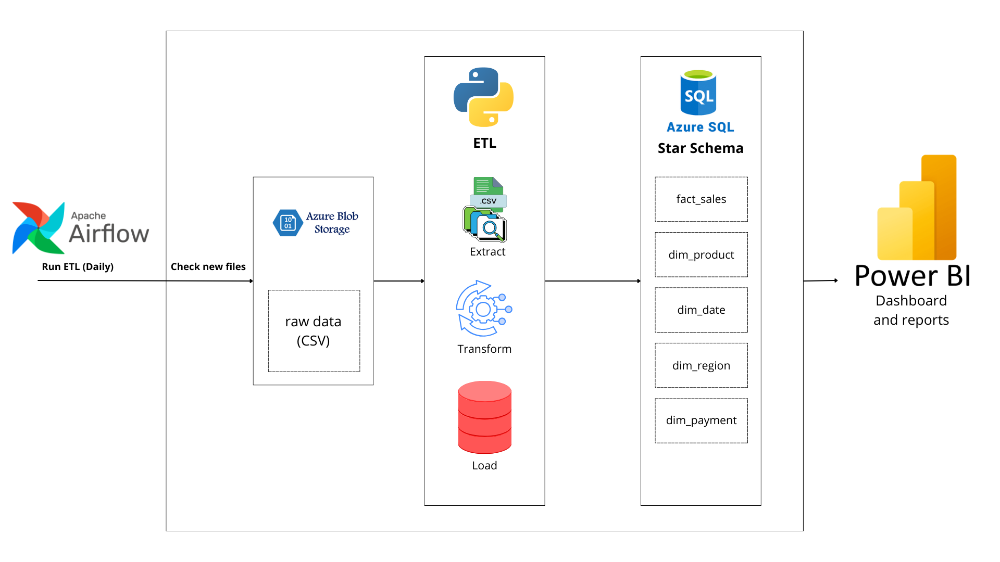
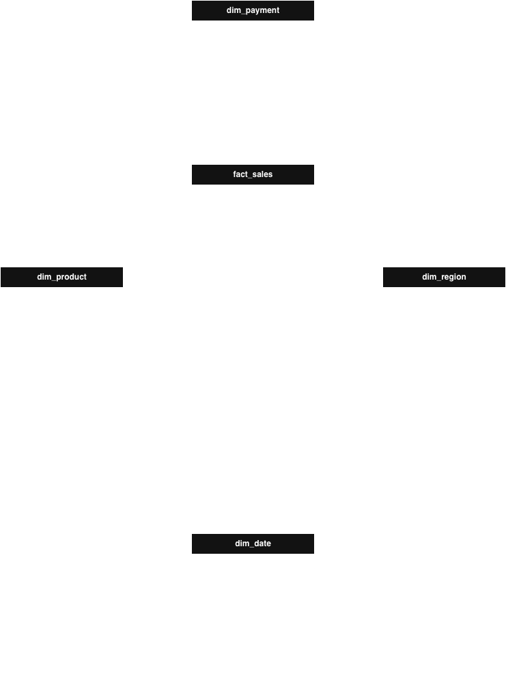
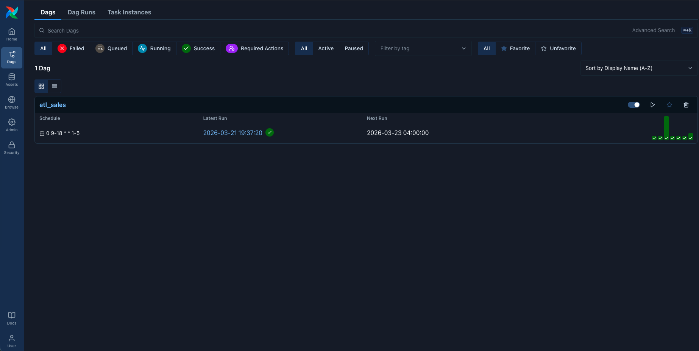

# ETL Sales Azure Airflow

End-to-end ETL pipeline that extracts sales data from Azure Data Lake Storage Gen2,
transforms it using Python and Pandas applying a Star Schema design, and loads it
incrementally into Azure SQL, orchestrated daily with Apache Airflow running on Docker.

---

## Architecture


---

## Tech Stack

| Technology | Usage |
|-----------|-------|
| Python 3.14 | Core language |
| Pandas | Data transformation and cleaning |
| Apache Airflow 3.x | Pipeline orchestration |
| Docker & Docker Compose | Airflow containerization |
| Azure Data Lake Gen2 | Raw data source storage |
| Azure SQL | Data warehouse destination |
| SQLAlchemy | Database ORM for incremental load |
| pyodbc | ODBC Driver for Azure SQL connection |
| uv | Python package manager |

---

## Project Structure
```
etl_sales_azure_airflow/
│
├── dags/
│   └── etl_sales.py              # Airflow DAG with TaskFlow API
│
├── plugins/
│   ├── etl/
│   │   ├── extract.py            # Azure Data Lake extraction
│   │   ├── transform.py          # Data cleaning and Star Schema building
│   │   └── load.py               # Incremental load to Azure SQL
│   └── utils/
│       └── logger.py             # Centralized logging configuration
│
├── db/
│   ├── init_db.py                # Database and schema initialization (run once)
│   ├── ER_schema.png             # Star Schema ER diagram
│   └── migrations/
│       ├── 01_create_database.sql
│       ├── 02_create_schema.sql
│       ├── 03_create_dim_tables.sql
│       └── 04_create_fact_table.sql
│
├── data/
│   └── raw/                      # Local sample data (not tracked in git)
│
├── Dockerfile                    # Extended Airflow image with dependencies
├── docker-compose.yaml           # Airflow services configuration
├── exe_pipeline.py               # Local pipeline runner (without Airflow)
├── requirements.txt              # Docker dependencies
├── pyproject.toml                # uv project configuration
└── .env.example                  # Environment variables template
```

---

## Star Schema



The Star Schema is designed under the `gold` schema in Azure SQL and consists of:

- **fact_sales** → Core sales transactions with metrics like price, revenue, discount and rating
- **dim_product** → Product categories
- **dim_region** → Customer regions
- **dim_payment** → Payment methods
- **dim_date** → Date dimension with day, month, quarter, year and day of week

---

## ETL Pipeline

### Extract
Connects to Azure Data Lake Storage Gen2 (`stetlazureairflowdev01`) and lists all files
in the `new/` directory of the `raw-data` container. Each file is downloaded directly
into memory as a Pandas DataFrame without touching the local disk.

### Transform
Applies the following steps in order:
1. Column renaming and standardization
2. Data type conversion (dates, numerics)
3. Whitespace removal and empty string handling
4. Null value treatment (drop critical columns, fill non-critical with 0)
5. Business validations (positive prices, discount 0-100, rating 0-5)
6. Duplicate removal
7. Star Schema construction (fact and dimension tables)

### Load
Incremental load strategy:
1. Reads existing records from each dimension table in Azure SQL
2. Inserts only new records (avoiding duplicates by unique column)
3. Reads back the dimension tables with their auto-generated IDs (`IDENTITY`)
4. Merges IDs into the fact table
5. Appends fact records to `gold.fact_sales`

After a successful load the processed file is moved from `new/` to `processed/`.
If the pipeline fails the file is moved to `error/` for manual review.

---

## Prerequisites

- Docker Desktop
- [ODBC Driver 18 for SQL Server](https://learn.microsoft.com/en-us/sql/connect/odbc/download-odbc-driver-for-sql-server)
- [uv](https://docs.astral.sh/uv/) (for local execution)
- Azure Data Lake Storage Gen2 account
- Azure SQL Server

## ODBC Driver

The ODBC Driver is required to connect to SQL Server.

- When running locally with `uv`: you must install it manually.
- When running in Docker (Airflow): it may already be included in the base image.
  If not, you must install it in the Dockerfile.

Verify if the driver is already installed in the container
```bash
docker exec -it <container_id> bash
odbcinst -q -d
```
if you see something like this:

`[ODBC Driver 18 for SQL Server]`

✔ The driver is correctly installed.

**macOS:**
```bash
# Add Microsoft repository to Homebrew
brew tap microsoft/mssql-release https://github.com/Microsoft/homebrew-mssql-release
# Update Homebrew
brew update
# Install the driver, automatically accepting the license.
HOMEBREW_ACCEPT_EULA=Y brew install msodbcsql18 mssql-tools18
```

**Windows:**
Download and install [ODBC Driver 18 for SQL Server](https://learn.microsoft.com/en-us/sql/connect/odbc/download-odbc-driver-for-sql-server) directly from Microsoft.

---

## Setup

### 1. Clone the repository
```bash
git clone https://github.com/luisruro/etl_sales_azure_airflow.git
cd etl_sales_azure_airflow
```

### 2. Configure environment variables
```bash
cp .env.example .env
```
Fill in your credentials in `.env` (see [Environment Variables](#environment-variables) section).

### 3. Extend the Airflow image

This project uses a custom Airflow image that includes the Python dependencies
needed for the ETL pipeline.

First generate the `requirements.txt` from `uv`:
```bash
uv export --no-hashes -o requirements.txt
```

The `Dockerfile` extends the official Airflow image and installs the dependencies:
```dockerfile
FROM apache/airflow:3.1.7

COPY requirements.txt .

RUN pip install --upgrade pip \
    && pip install --no-cache-dir -r requirements.txt
```

Build the extended image:
```bash
docker build . --tag extending_airflow:latest
```

In `docker-compose.yaml` the image is already configured to use the extended image:
```yaml
image: ${AIRFLOW_IMAGE_NAME:-extending_airflow:latest}
```

### 4. Start Airflow
```bash
docker compose up -d
```
Access the Airflow UI at `http://localhost:8080` with credentials `airflow / airflow`.

### 5. Initialize the database (run once)
```bash
uv sync
uv run db/init_db.py
```

---

## Updating Dependencies

When you add or change a dependency run the following commands to rebuild the image:
```bash
uv export --no-hashes -o requirements.txt
docker build . --tag extending_airflow:latest
docker compose down
docker compose up -d
```

## Environment Variables

| Variable | Description |
|----------|-------------|
| `AIRFLOW_UID` | Airflow user ID (use `50000`) |
| `AZURE_STORAGE_CONNECTION_STRING` | Azure Data Lake connection string |
| `AZURE_CONTAINER_NAME` | Blob container name (`raw-data`) |
| `NEW_DATA_DIRECTORY` | New files directory (`new`) |
| `PROCESSED_DATA_DESTINATION` | Processed files directory (`processed`) |
| `ERROR_DATA_DESTINATION` | Error files directory (`error`) |
| `AZURE_SQL_SERVER` | Azure SQL server URL |
| `AZURE_SQL_USERNAME` | Azure SQL username |
| `AZURE_SQL_PASSWORD` | Azure SQL password |
| `TARGET_DB` | Target database name |

---

## Running Locally (without Airflow)
```bash
uv sync
uv run exe_pipeline.py
```

---

## Airflow DAG



The DAG `etl_sales` runs every hour on business days (Monday to Friday, 9AM to 6PM):
```
check_new_files → extract_transform_load
```

- **check_new_files** → Lists files in `new/` directory. Skips if no files found.
- **extract_transform_load** → Runs the full ETL pipeline for each new file.

---

## Database Initialization

The `db/init_db.py` script is designed to run **once** to set up the database structure.
It creates the database, the `gold` schema and all dimension and fact tables with their
foreign key constraints. It does not need to be part of the daily orchestration.
```bash
uv run db/init_db.py
```